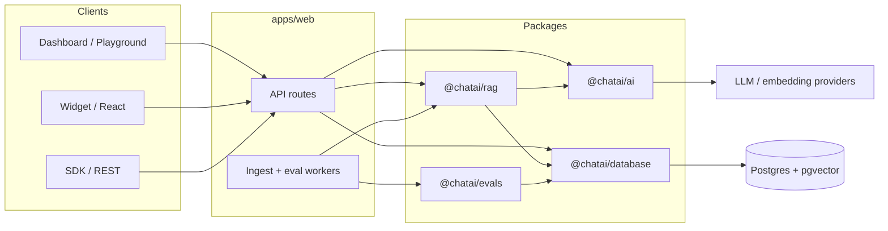

ChatAI is a pnpm + Turborepo monorepo. The production Docker image runs `apps/web` (Next.js) with an in-process ingest worker and Postgres + pgvector.

## Package roles

| Package / app | Role |
| --- | --- |
| `apps/web` | Dashboard, auth, APIs, hosted `/widget/chat.js`, workers |
| `apps/docs` | Fumadocs documentation site (this site) |
| `packages/database` | Drizzle schema, migrations, DB client |
| `packages/ai` | Provider registry, chat + embeddings |
| `packages/rag` | Ingest, chunk, retrieve, answer |
| `packages/evals` | Offline / online quality scoring |
| `packages/sdk` | TypeScript REST client + OpenAPI document |
| `packages/widget` / `widget-core` / `react` | Embeddable UI |

## Runtime notes

- Migrations on Docker boot: `packages/database/scripts/migrate.mjs`
- Health: `GET /api/health`
- Dual auth on chat: widget `publicId` (keyless) vs Bearer `sk_` for SDK/REST

## Related

- [Installation](/docs/installation)
- [Docker](/docs/self-hosting/docker)
- [Contributing](/docs/contributing)
