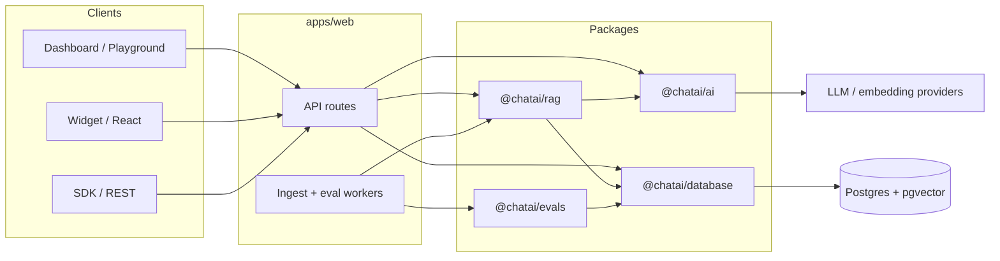

ChatAI is a pnpm + Turborepo monorepo. The production Docker image runs `apps/web` (Next.js) with an in-process ingest worker and Postgres + pgvector.

## Package roles

| Package / app | Role |
| --- | --- |
| `apps/web` | Dashboard, auth, APIs, hosted `/widget/chat.js`, workers |
| `apps/docs` | Fumadocs documentation site (this site) |
| `packages/database` | Drizzle schema, migrations, DB client |
| `packages/ai` | Provider registry, chat + embeddings |
| `packages/rag` | Ingest, chunk, retrieve, answer |
| `packages/evals` | Offline / online quality scoring |
| `packages/sdk` | TypeScript REST client + OpenAPI document |
| `packages/widget` / `widget-core` / `react` | Embeddable UI |

## Embeddable widget

The widget is split into three published layers, each with one job:

| Package | Owns | Does not own |
| --- | --- | --- |
| `@nightzeros/chatai-widget-core` | HTTP calls, SSE stream parsing, chat state, visitor IDs and storage, the browser Voice client | Any rendering |
| `@nightzeros/chatai-widget` | Preact UI rendered inside a Shadow DOM root, the `mountWidget` API, and the hosted `chat.js` bundle | Framework integration |
| `@nightzeros/chatai-react` | React lifecycle only: mount once, remount when a supported option changes, destroy on unmount; renders `null` on the server | Rendering, requests or chat state |

Design choices behind this split:

- **Shadow DOM** isolates widget styles from the host page in both directions, so a site's CSS can't break the widget and the widget can't leak styles out.
- **Preact stays internal** to the widget package. React apps only take React as a peer dependency (18 or 19), and script-tag embeds never load React.
- **One chat implementation.** The script tag, the React component and the dashboard preview all mount the same widget, so behavior can't drift between embeds.
- **Display overrides win over public config.** Mount options such as `primaryColor` or `theme` override the assistant's saved appearance, which is what lets the dashboard preview unsaved settings.
- **Layout modes.** `fixed` (default) pins the launcher to the viewport for production embeds; `contained` keeps the widget inside a parent element.

The dashboard's **Customize** page uses these pieces for its draft preview: it mounts the real widget with the unsaved form values, `layout: "contained"`, and a no-op storage so preview conversations never reach `localStorage` or a deployed embed. Only **Save** publishes settings.

The hosted `/widget/chat.js` is built from `packages/widget` and copied into `apps/web/public/widget/` at build time; `pnpm widget:check` keeps it under its size budget.

## Runtime notes

- Migrations on Docker boot: `packages/database/scripts/migrate.mjs`
- Health: `GET /api/health`
- Dual auth on chat: widget `publicId` (keyless) vs Bearer `sk_` for SDK/REST
- Voice (preview) sessions are supervised in the web process, so Voice needs a long-lived Node.js server; see [Voice in production](/docs/self-hosting/docker#voice-in-production)
- Every text and Voice answer passes through the same scope policy in `packages/rag`; see [Scope and Profile](/docs/assistants#scope-and-profile)

## Related

- [Installation](/docs/installation)
- [Docker](/docs/self-hosting/docker)
- [Contributing](/docs/contributing)
