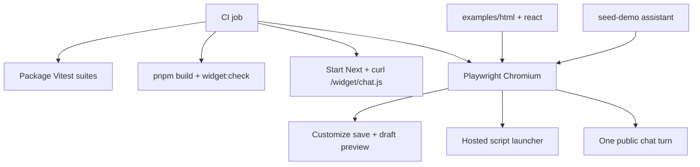

# v0.2 Verification and Release Readiness Design

## Goal

Make v0.2 releasable by proving the hosted widget, self-host path, React wrapper, Customize draft preview, and Install docs work together, then enforcing that proof in CI.

## Scope

In scope:

- Minimal runnable examples: `examples/html-widget/` and `examples/react-widget/`
- Playwright browser integration tests for critical v0.2 flows only
- README updates for hosted embed, self-host, React (workspace-only until npm publish), settings, CORS/`publicId` honesty, and troubleshooting
- CI extension: keep lint/typecheck/build/`widget:check`, add package unit tests, Playwright, and a hosted-route smoke after build
- Root/`turbo` `test` aggregation so CI has one test entry point

Out of scope for this Task 7 pass:

- Broad dashboard regression coverage beyond Customize/preview/save
- Multi-browser matrix beyond Chromium in CI
- Docker image build in CI
- npm publishing of `@chatai/react` / `@chatai/widget`
- Domain allowlists, signing, or rate limits (deferred to v0.8)

## Architecture

Examples are workspace fixtures, not published apps. HTML uses the built `/widget/chat.js` (or a copied self-host file with `data-api-url`). React uses `workspace:*` `@chatai/react`. Playwright drives a seeded local app and the HTML fixture; it does not reimplement widget logic.

## Playwright coverage (critical path only)

1. **Customize + save:** open Customize, change accent color (or theme), save, see success feedback.
2. **Draft preview:** before save, confirm the live preview receives the draft override (contained launcher / accent).
3. **Public widget load:** open HTML fixture (or Install page host) that loads `/widget/chat.js` with the demo `publicId`; assert Shadow DOM launcher appears.
4. **Basic chat:** open launcher, send one message, assert an assistant reply streams or appears (no requirement to assert sources or continuity in this first pass).

Self-host path is covered by a second HTML fixture or the same fixture with a copied `chat.js` + `data-api-url`, smoke-asserting launcher mount only (not a second full chat).

## CI shape

Single `check` job (or a clearly sequenced job) that:

1. `pnpm install --frozen-lockfile`
2. `pnpm lint`
3. `pnpm typecheck`
4. `pnpm test` (aggregated unit tests across widget-core, widget, react, web)
5. `pnpm build` (includes widget prebuild/copy)
6. `pnpm widget:check`
7. Start production `next start` (or equivalent) with CI env + migrate/seed as needed
8. Route smoke: `GET /widget/chat.js` returns JS + expected markers
9. Playwright Chromium against critical flows
10. Tear down server

Playwright browsers install via `npx playwright install --with-deps chromium` (or pnpm equivalent) in CI only.

## Examples

- `examples/html-widget/index.html` — hosted script tag; env placeholders for origin + publicId
- `examples/html-widget/self-host.html` — local `chat.js` + `data-api-url`
- `examples/react-widget/` — Vite + React, `workspace:*` `@chatai/react`, documents that the package is private until publish

No secrets in fixtures. Demo credentials/`publicId` come from env or `seed:demo` output.

## Docs

README replaces the “Next: embeddable widget (v0.2)” stub with:

- Monorepo packages including widget-core, widget, react
- Hosted `<script>` install
- Self-host copy + `data-api-url`
- React workspace usage (honest about private packages)
- Customize settings fields
- Security: `publicId` is a publishable capability; allowlists/rate limits are v0.8
- Troubleshooting API origin mismatches

Install tab React snippet may note workspace/private status so docs stay consistent.

## Testing strategy

| Layer | Tool | Purpose |
|-------|------|---------|
| Unit | Existing Vitest | Core, mount, React lifecycle, snippets, delivery |
| Route smoke | curl/check script | Hosted asset present with correct markers |
| Browser | Playwright Chromium | Critical Customize + widget + one chat turn |
| Manual | Desktop/mobile widths | Visual pass before tagging v0.2 |

## Constraints

- Packages remain `private: true`
- No Docker CI build in this pass
- Chromium-only Playwright in CI
- Seeded demo assistant is the fixture source of truth for publicId
- Keep existing lint, typecheck, build, and `widget:check` steps
